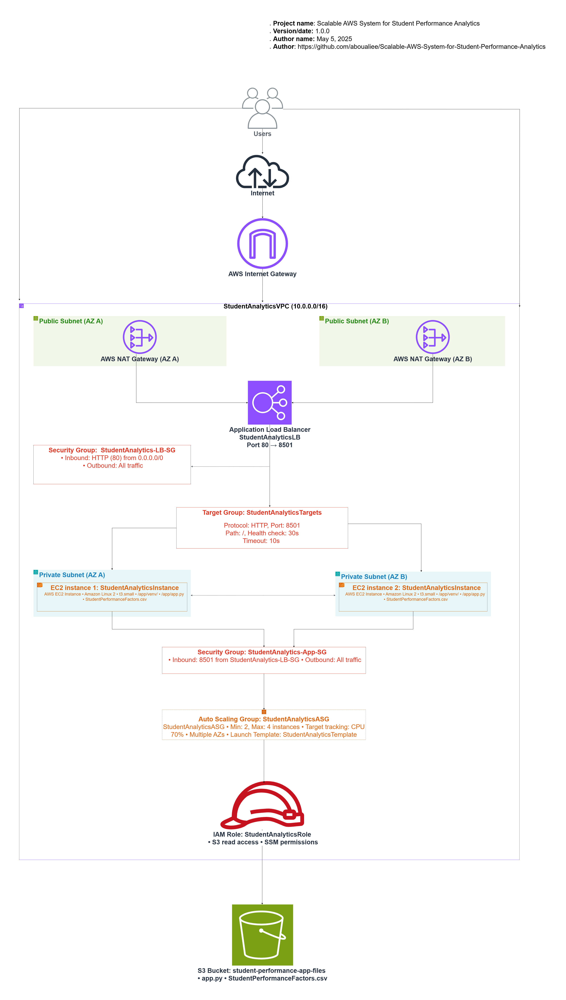
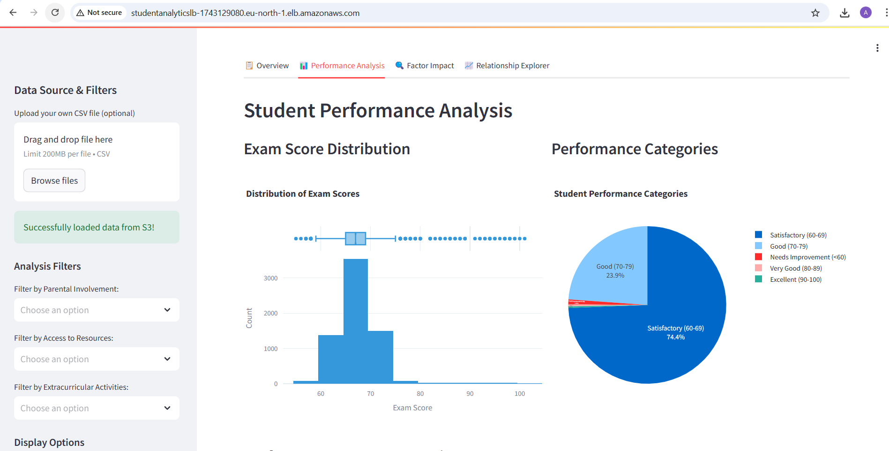

# Scalable AWS System for Student Performance Analytics

## Description
A scalable, fault-tolerant platform deployed on AWS for analyzing student performance data through a **Streamlit-based interactive dashboard**. Designed with high availability, auto-scaling, and real-time visualization in mind, this platform provides insights into student performance across various factors such as hours studied, attendance, and parental involvement.

## Overview

This **Scalable AWS System** is a **high-availability platform** deployed on AWS that provides insights into factors influencing student performance. It features a **Streamlit-based dashboard** for interactive data visualization and analysis, leveraging Python's data science stack. The system is designed with scalability, fault tolerance, and ease of use in mind.

## Features

- **Interactive Dashboard**: Analyze student performance data with visualizations such as scatter plots, heatmaps, and histograms.
- **AWS Integration**: Deployed on AWS with a custom VPC, auto-scaling groups, and an application load balancer.
- **Fault Tolerance**: High availability with a minimum of two EC2 instances and health monitoring.
- **Scalability**: Auto-scaling based on CPU usage to handle traffic spikes.
- **Data Analysis**: Supports analysis of numerical and categorical variables, missing data visualization, and outlier detection.

## Architecture

  
*Fig 1: AWS Student Analytics System Architecture*

### Architecture Components:
The system architecture utilizes the following AWS components, with names configured for each service:

1. **Custom VPC**:
   - VPC CIDR block: `10.0.0.0/16`
   - Public and private subnets for security and isolation.

2. **Application Load Balancer (ALB)**:
   - **Name**: **StudentAnalyticsLB**
   - Routes incoming HTTP/HTTPS traffic to healthy EC2 instances in private subnets.
   - Health checks configured on port `8501`.

3. **Auto Scaling Group (ASG)**:
   - **Auto Scaling Group Name**: **StudentAnalyticsASG**
   - Maintains a desired capacity of EC2 instances based on CPU utilization.
   - Minimum instances: 2  
   - Maximum instances: 4

4. **EC2 Instances**:
   - **EC2 Instance Name**: **StudentAnalyticsInstance**
   - Instances are launched in private subnets and run the Streamlit application.
   - Instances are automatically managed by the auto-scaling group.

5. **S3 Bucket**:
   - **Bucket Name**: **student-performance-app-files**
   - Stores application code and data files (e.g., `app.py`, `StudentPerformanceFactors.csv`).

6. **Security Groups**:
   - **Load Balancer Security Group**: **StudentAnalytics-LB-SG**
   - **Application Security Group**: **StudentAnalytics-App-SG**

7. **Key Pair**:
   - **Name**: **studentanalyst_keypair**
   - Used for secure SSH access to instances when needed.

8. **IAM Role**:
   - **Name**: **StudentAnalyticsRole**
   - Provides S3 read access and SSM permissions.

## Application Interface

The interactive dashboard allows users to explore exam performance using various filters and visual insights. Below is a snapshot of the dashboard in action:

  
*Fig 2: Student Performance Analytics Dashboard Interface*

The dashboard includes:
- Data upload capabilities (with default dataset loaded from S3)
- Interactive filters for different student attributes
- Exam score distribution visualization
- Performance categories breakdown
- Multiple analysis views (Overview, Performance Analysis, Factor Impact, Relationship Explorer)

## Deployment Process

### 1. Infrastructure Setup
- **Custom VPC**: Created with CIDR block `10.0.0.0/16`.
- **Public Subnets**: Used for the Application Load Balancer (`StudentAnalyticsLB`) to handle HTTP/HTTPS traffic.
- **Private Subnets**: Used for the EC2 instances (`StudentAnalyticsInstance`) to ensure security and isolation.
- **NAT Gateway**: Configured to allow outbound internet access from private subnets.

### 2. Security Groups
- **Load Balancer Security Group** (`StudentAnalytics-LB-SG`): Allows inbound HTTP traffic (port 80).
- **Application Security Group** (`StudentAnalytics-App-SG`): Allows inbound traffic on port 8501 from the load balancer.

### 3. IAM Role
- **EC2 IAM Role** (`StudentAnalyticsRole`): Allows EC2 instances (`StudentAnalyticsInstance`) to read from the **S3 bucket** (`student-performance-app-files`).
- **SSM Permissions**: Included for secure session management without requiring direct SSH access.

### 4. Application File Preparation
- **S3 Bucket**: Created the bucket `student-performance-app-files` and uploaded:
  - `app.py`: Streamlit application code.
  - `StudentPerformanceFactors.csv`: Dataset for analysis.

### 5. EC2 Launch Template
- **Launch Template Name**: **StudentAnalyticsTemplate**
- Selected **Amazon Linux 2 AMI**, with **t3.small** instance type, associated with the **Application Security Group**.
- **Key Pair**: Associated with **studentanalyst_keypair** for secure SSH access when needed.
- **User Data Script**: Configured to download application files from **S3** and set up the Streamlit application in a Python virtual environment.

### 6. Load Balancer and Target Group
- **Target Group Name**: **StudentAnalyticsTargets**
- Configured to monitor instances on port `8501` with health checks and success criteria.
- **Application Load Balancer**: Associated with **StudentAnalyticsLB**, placed in public subnets, and configured to forward traffic to the target group.

### 7. Auto Scaling Group Configuration
- **Auto Scaling Group**: Created with the **StudentAnalyticsTemplate**.
- Set minimum instances to 2 and maximum instances to 4.
- Configured to scale based on CPU utilization, with health monitoring via the target group.

## Auto Scaling and High Availability

The system is designed to handle traffic spikes and ensure high availability using the following configurations:

- **Minimum Instances**: The Auto Scaling Group (`StudentAnalyticsASG`) maintains at least 2 instances (`StudentAnalyticsInstance`) to ensure redundancy.
- **Maximum Instances**: The system can scale up to 4 instances during high traffic periods.
- **Scaling Policy**: Instances are added or removed based on CPU utilization, with a target threshold of 70%.
- **Health Monitoring**: The **Application Load Balancer** (`StudentAnalyticsLB`) performs health checks on instances to ensure only healthy instances receive traffic.

## Exploratory Data Analysis

The project includes a Jupyter Notebook (`notebooks/exploratory_analysis.ipynb`) for performing exploratory data analysis (EDA) on the student performance dataset. Key steps include:

1. **Data Overview**:
   - Display dataset structure using `data.info()` and `data.describe()`.
   - Identify missing values with `data.isnull().sum()`.

2. **Numerical Variable Analysis**:
   - Generate a correlation heatmap for numerical variables.
   - Create scatter plots to visualize relationships between numerical variables and `Exam_Score`.

3. **Categorical Variable Analysis**:
   - Use boxplots to analyze the impact of categorical variables (e.g., `Parental_Involvement`) on `Exam_Score`.
   - Generate count plots for categorical variables to understand their distributions.

4. **Missing Data Analysis**:
   - Visualize missing data using a heatmap.

5. **Feature Relationships**:
   - Create pair plots to explore relationships between numerical variables, grouped by categorical variables (e.g., `Gender`).

6. **Outlier Detection**:
   - Use boxplots to detect outliers in numerical variables (e.g., `Hours_Studied`).

7. **Grade Distribution**:
   - Visualize the distribution of `Exam_Score` using a histogram with a KDE overlay.

## How to Run Locally

1. Clone the repository:
    ```bash
    git clone https://github.com/yourusername/Scalable-AWS-System-for-Student-Performance-Analysis.git
    cd Scalable-AWS-System-for-Student-Performance-Analysis
    ```

2. Install the required dependencies:
    ```bash
    pip install -r requirements.txt
    ```

3. Run the Streamlit application:
    ```bash
    streamlit run app/app.py
    ```

4. Open the application in your browser at [http://localhost:8501](http://localhost:8501).


## Accessing the Application

Once the application is deployed, you can access it via the public DNS of your **Application Load Balancer**:

```
http://StudentAnalyticsLB-1743129080.eu-north-1.elb.amazonaws.com
```


